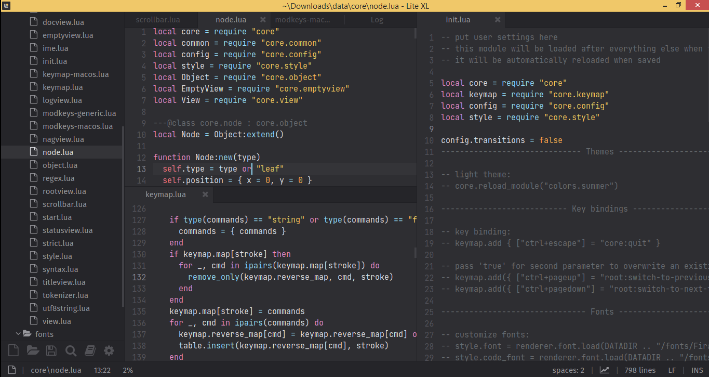

# From [https://lite-xl.com](https://lite-xl.com):

> A lightweight, simple, fast, feature-filled, and extremely extensible text editor written in C, and Lua, adapted from lite.




It is recommended that you disable transitions for better performance. Add the following to your init.lua:
```
config.transitions = false
```

## Note for Windows 8.1
You _may_ need some system DLLs if you are missing a system update, you can find those here: https://github.com/armdevvel/mxe-SHARED/blob/master/resources/WinUCRT.tar.xz