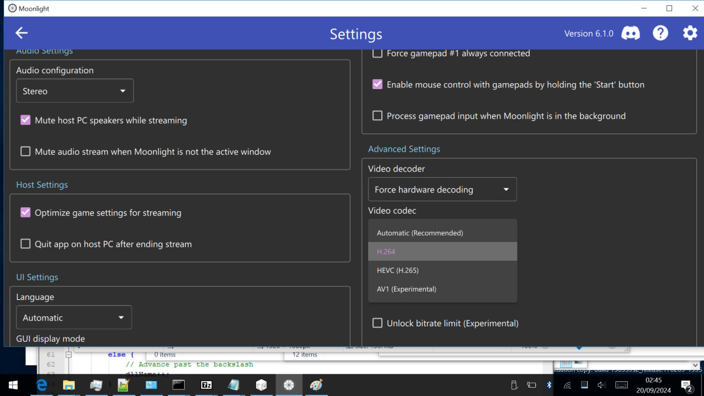
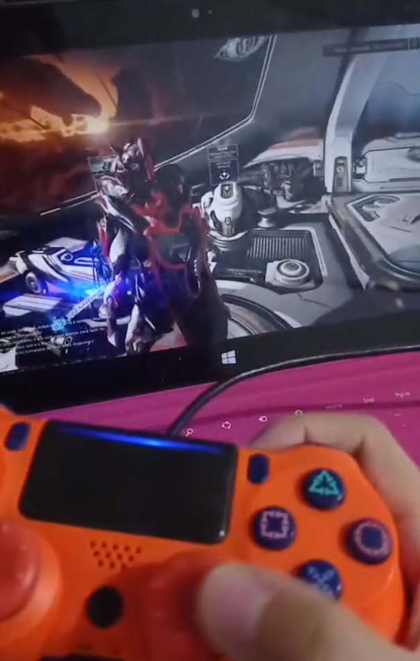

# Description from [https://moonlight-stream.org/](https://moonlight-stream.org/):

## Moonlight allows you to play your PC games on almost any device, whether you're in another room or miles away from your gaming rig.

Moonlight (formerly Limelight) is an open source implementation of NVIDIA's GameStream protocol. We implemented the protocol used by the NVIDIA Shield and wrote a set of 3rd party clients.

You can stream your collection of PC games from your GameStream-compatible PC to any supported device and play them remotely. Moonlight is perfect for gaming on the go without sacrificing the graphics and game selection available on PC.

## The port
jeybee has put the work in to port Qt and Moonlight to the SurfaceRT platform. This should support most bluetooth controllers, USB peripherals, etc.

You can use [Sushine](https://app.lizardbyte.dev/Sunshine/?lng=en-US) to run a GameStream-compatible server on any machine and use it for games, productivity, or just general desktop usage.

